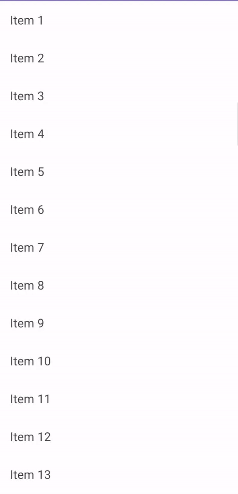

## EasyPagination (Android Kotlin)
[](https://kotlinlang.org/)
[](LICENSE)
[](#)

EasyPagination is a lightweight and reusable Android Kotlin library that helps you implement:

✅ Infinite Scroll Pagination  
✅ Pull-to-Refresh Support  
✅ Loading / Empty / Error State Handling  
✅ Footer Loader + Retry Support  
✅ Clean Paging Controller API  

It is designed to be extremely simple to integrate into any RecyclerView project without using complex Paging3 setups.

---

### Preview



---

### Features

-  **Infinite Scrolling Pagination**
-  **Swipe to Refresh Support**
-  **Full Screen Loading View**
-  **Default Empty View**
-  **Default Error View**
-  **Footer Loading for Next Pages**
-  **Footer Retry Button for Page Errors**
-  **Controller Based API (`submitPage()`)**
-  **Last Page Detection Support**
-  Minimal and easy-to-customize codebase

---

## Installation (JitPack)

### 1️⃣ Add JitPack to your **root `settings.gradle` or `build.gradle`**

```gradle
dependencyResolutionManagement {
    repositories {
        google()
        mavenCentral()
        maven { url 'https://jitpack.io' }
    }
}
```
### Add Dependency
```
dependencies {
	        implementation 'com.github.Excelsior-Technologies-Community:Android_EasyPagination:1.0.0'
	}
```

---

### Usage

RecyclerView Layout Must Use FrameLayout

EasyPagination dynamically adds loading/empty/error views, so your RecyclerView must be inside a FrameLayout.
```xml
<FrameLayout
    android:layout_width="match_parent"
    android:layout_height="match_parent">

    <androidx.swiperefreshlayout.widget.SwipeRefreshLayout
        android:id="@+id/swipeRefresh"
        android:layout_width="match_parent"
        android:layout_height="match_parent">

        <androidx.recyclerview.widget.RecyclerView
            android:id="@+id/recyclerView"
            android:layout_width="match_parent"
            android:layout_height="match_parent"/>

    </androidx.swiperefreshlayout.widget.SwipeRefreshLayout>

</FrameLayout>
```

**Step 1: Implement PagingDataAdapter**

Your adapter must implement PagingDataAdapter<T> so EasyPagination can update list data correctly.
```kotlin
class UserAdapter :
    RecyclerView.Adapter<UserAdapter.UserViewHolder>(),
    PagingDataAdapter<String> {

    private val items = mutableListOf<String>()

    override fun setItems(items: List<String>) {
        this.items.clear()
        this.items.addAll(items)
        notifyDataSetChanged()
    }

    override fun addItems(items: List<String>) {
        this.items.addAll(items)
        notifyDataSetChanged()
    }

    ...
}
```

**Step 2: Attach Pagination in Activity**
```kotlin
private lateinit var paging: EasyPagingController<String>

paging = EasyPagination.attach(
    recyclerView = binding.recyclerView,
    swipeRefreshLayout = binding.swipeRefresh,
    adapter = adapter
) { page ->

    // Load page data here
    loadPage(page)
}
```

**Step 3: Submit API Response**
```kotlin
paging.submitPage(
    page = page,
    items = responseList,
    isLastPage = responseList.isEmpty()
)
```

**Handle Errors**

First Page Error (Fullscreen)
```kotlin
paging.submitError("Network Failed")
```

Next Page Error (Footer Retry)

Footer retry automatically appears.

**Stop Pagination (Last Page)**

If API returns no more data:
```kotlin
paging.submitPage(
    page = page,
    items = emptyList(),
    isLastPage = true
)
```

### Complete Example
```kotlin
private fun loadFakeApi(page: Int) {

    Handler(Looper.getMainLooper()).postDelayed({

        val data =
            if (page <= 3) {
                List(15) { "Item ${(page - 1) * 15 + it + 1}" }
            } else emptyList()

        paging.submitPage(
            page = page,
            items = data,
            isLastPage = data.isEmpty()
        )

    }, 1500)
}
```

---

### License

```
MIT License

Copyright (c) 2025 Excelsior Technologies 

Permission is hereby granted, free of charge, to any person obtaining a copy
of this software and associated documentation files (the "Software"), to deal
in the Software without restriction, including without limitation the rights
to use, copy, modify, merge, publish, distribute, sublicense, and/or sell
copies of the Software, and to permit persons to whom the Software is
furnished to do so, subject to the following conditions:

The above copyright notice and this permission notice shall be included in all
copies or substantial portions of the Software.

THE SOFTWARE IS PROVIDED "AS IS", WITHOUT WARRANTY OF ANY KIND, EXPRESS OR
IMPLIED, INCLUDING BUT NOT LIMITED TO THE WARRANTIES OF MERCHANTABILITY,
FITNESS FOR A PARTICULAR PURPOSE AND NONINFRINGEMENT. IN NO EVENT SHALL THE
AUTHORS OR COPYRIGHT HOLDERS BE LIABLE FOR ANY CLAIM, DAMAGES OR OTHER
LIABILITY, WHETHER IN AN ACTION OF CONTRACT, TORT OR OTHERWISE, ARISING FROM,
OUT OF OR IN CONNECTION WITH THE SOFTWARE OR THE USE OR OTHER DEALINGS IN THE
SOFTWARE.
```

